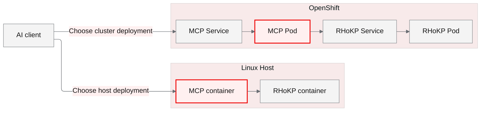

<!-- AI-Author: Codex (OpenAI model not exposed by runtime) -->

<div align="center">

# Red Hat Offline Knowledge Portal · MCP

### Your offline knowledge. Ready for AI.

Deploy RHoKP. Connect your agents. Keep retrieval inside your infrastructure.

[Host deployment](docs/host.md) · [OpenShift deployment](docs/openshift.md) · [MCP container](docs/container.md) · [AI skills](skills/)

</div>

---

Bring Red Hat Offline Knowledge Portal (RHoKP) to a Linux host or OpenShift, then expose its knowledge through a small, read-only Model Context Protocol server. Search documentation, retrieve solutions, and look up CVEs and advisories from an offline snapshot using an MCP-capable AI client.

This repository provides deployment automation and an independently packaged MCP adapter. Obtain the RHoKP image and access key through your own Red Hat entitlement. Red Hat knowledge content and vendor images are **not included** in this repository or in the MCP image.

## Choose your deployment

| | Linux host | OpenShift |
|---|---|---|
| Runtime | Podman containers managed by systemd Quadlet | Two Deployments with Services |
| RHoKP backend | Container on a private Podman network | RHoKP Pod behind a selector-based Service |
| MCP adapter | Dedicated MCP container | Dedicated MCP container |
| Default access | Host loopback | Cluster-internal Service |
| Start here | [Host guide](docs/host.md) | [OpenShift guide](docs/openshift.md) |

Both paths run RHoKP and MCP in their selected environment. OpenShift Services select cluster Pods; the OpenShift path does not require a host endpoint bridge.



## What your agent can do

| Tool | Purpose |
|---|---|
| `rhokp_health` | Inspect backend availability and snapshot metadata |
| `rhokp_search` | Search solutions, articles, documentation, CVEs and errata |
| `rhokp_get_document` | Retrieve bounded text from a returned document path |
| `rhokp_get_cve` | Read a CVE record by identifier |
| `rhokp_get_erratum` | Read a Red Hat advisory by identifier |

The adapter provides a stateless HTTP `/mcp` endpoint with Bearer authentication. Tools are read-only and constrain document paths and response sizes. No LLM provider or API key is required to run the adapter; an AI client supplies its own model if needed.

## Use a prebuilt release

The [release workflow](.github/workflows/release.yml) builds and tests the MCP image on GitHub Actions, publishes it to GHCR, and attaches a compressed container archive and checksums to the GitHub Release. The initial target is **linux/amd64**.

Download versioned builds from [GitHub Releases](https://github.com/wangzheng422/rhokp-mcp/releases) or pull from [GHCR](https://github.com/wangzheng422/rhokp-mcp/pkgs/container/rhokp-mcp). Assets appear after the release workflow completes successfully.

```bash
podman pull ghcr.io/wangzheng422/rhokp-mcp:v0.1.0
```

For offline transfer, download the image from the release:

```bash
gh release download v0.1.0 --repo wangzheng422/rhokp-mcp \
  --pattern 'rhokp-mcp-v0.1.0-linux-amd64.tar.gz' --pattern SHA256SUMS
sha256sum --check --ignore-missing SHA256SUMS
gunzip rhokp-mcp-v0.1.0-linux-amd64.tar.gz
podman load -i rhokp-mcp-v0.1.0-linux-amd64.tar
```

For the rootful host deployment, use `sudo podman pull` or `sudo podman load`, then set the Quadlet `Image=` to the released image reference. For OpenShift, use its registry digest and ensure cluster pull access. Follow the [host guide](docs/host.md) or [OpenShift guide](docs/openshift.md) with your separately obtained RHoKP image and access key. [Local builds](docs/container.md) remain available for development and customization.

## Connect and verify

Configure your MCP client with the deployed `/mcp` URL and an `Authorization: Bearer …` header from its secret store. Use [the client guide](docs/mcp-clients.md) for protocol examples and validation. OpenShift Lightspeed integration is covered in the [OpenShift guide](docs/openshift.md).

An effective acceptance check goes beyond a green Pod: initialize MCP, list tools, search the real portal, retrieve a returned document, and verify that the AI client's answer used the tool result. Tests in this repository use controlled fixtures; deployment validation requires your licensed backend.

## Built for operators and AI agents

| Entry | Purpose |
|---|---|
| [.github/workflows/release.yml](.github/workflows/release.yml) | Build and publish versioned images and Release downloads |
| [Containerfile](Containerfile) / [mcp/](mcp/) | Image definition and canonical adapter |
| [deploy/host/](deploy/host/) | Podman and Quadlet deployment |
| [deploy/openshift/](deploy/openshift/) | OpenShift deployment |
| [docs/](docs/) | Deployment and client guides |
| [skills/](skills/) / [AGENTS.md](AGENTS.md) | AI deployment workflows and contributor instructions |
| [tests/](tests/) | Adapter and HTTP validation |

Read [AGENTS.md](AGENTS.md) before automated changes. Skills refer to this checkout's deployment files, so retain the complete repository when reusing them. See [contributing](CONTRIBUTING.md) for local verification and [security](SECURITY.md) for credential handling.

## Operational boundaries

- Knowledge freshness follows the RHoKP snapshot you deploy. An offline snapshot is not a live vulnerability feed.
- The full portal and a Lightspeed-managed retrieval index can expose different schemas. Point this adapter at the full portal expected by its search implementation.
- Image storage and writable Solr storage are different capacity concerns. Inspect the chosen vendor image before changing mounts or capacity.
- Protect remote access with TLS and an appropriate network boundary. Default deployment endpoints are intended for local or cluster-internal access.
- Disconnected installation also requires mirroring the MCP runtime image, the vendor image and their dependencies before disconnection.

This community integration is licensed under [Apache-2.0](LICENSE), and is not an official Red Hat product. Red Hat and OpenShift are trademarks of Red Hat, Inc. Vendor software and knowledge remain subject to their own terms. See [release notes](docs/releasing.md) for the publishing process.
